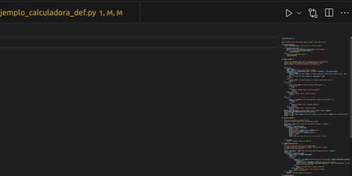
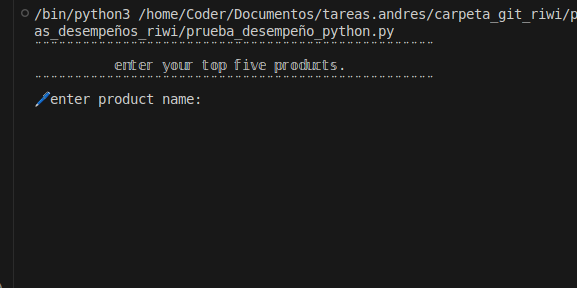
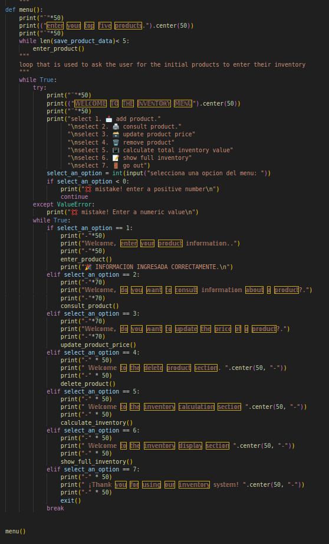
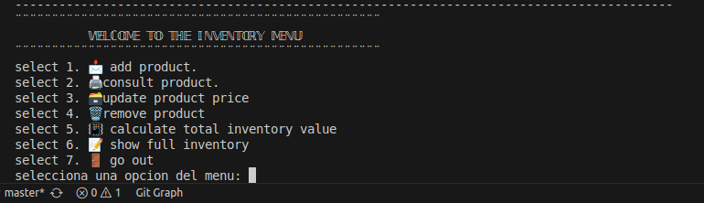
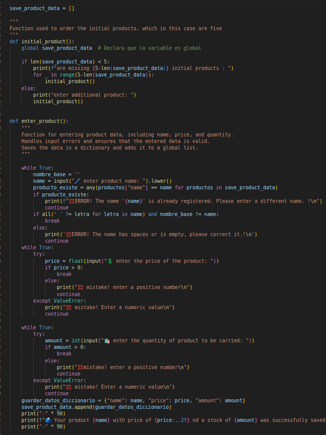
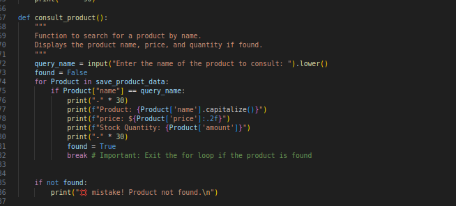
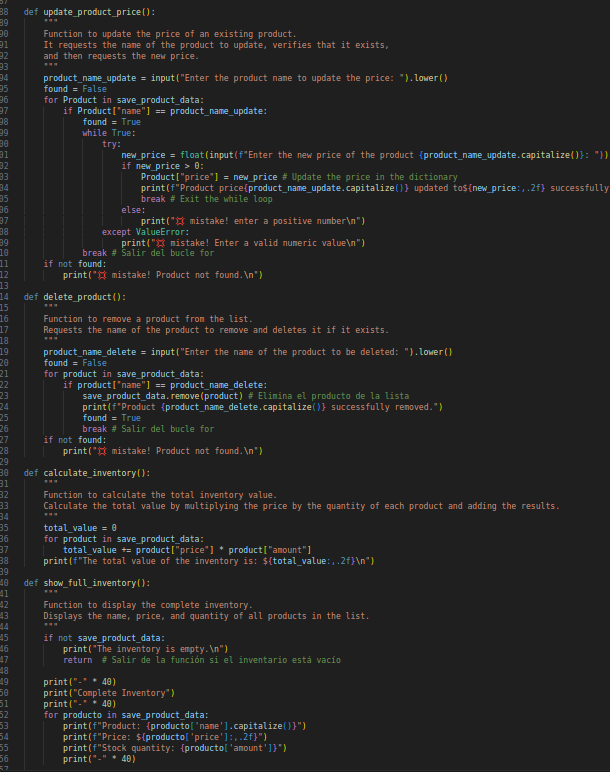

# inicio de seccion
"""
para iniciar con el codigo se comienza undiendo el boton que esta en triangulito del lado derecho. la imagen de abajo lo muestra mejor.
"""

# pedir al usuario los productos
"""
el sistema es un inventario. y como requisito pido que si o si ingrese con 5 productos iniciales y eso es lo que primero se le pide.
"""

# mostrar menu
"""
despues de ingresar los 5 productos iniciales, se le muestra e¿un menu con las diferentes opcion que quiera ver de los productos.
"""

"""
esto es com se ve en la terminal que es donde se ejecuta el codigo.
"""

# opcion de ingresar producto

"""
este es el uso de la primera funcion
Function used to order the initial products, which in this case are five
"""
"""
 """
 esta es la segunda funcion
    Function for entering product data, including name, price, and quantity.
    Handles input errors and ensures that the entered data is valid.
    Saves the data in a dictionary and adds it to a global list.
    """
"""

# opcion de consultar producto
"""
 Function to search for a product by name.
    Displays the product name, price, and quantity if found.
"""

# opcion de eliminar, calcular, mostrar todo el inventario producto
"""
esta iamgen sirve para mostrar cuales son las funciones que se usan para eliminar, mostrar todo el inventario, y calcular.

"""

